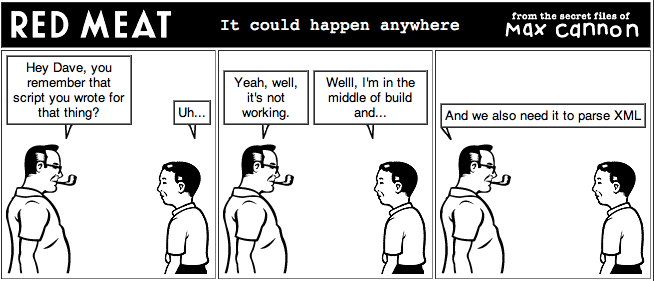

!SLIDE smbullets
# Ruby for Awesome #
# Command Line Applications #
## Dave Copeland
* [@davetron5000](http://www.twitter.com/davetron5000) / davidcopeland (at) naildrivin5.com
* [naildrivin5.com/blog](http://www.naildrivin5.com/blog)
* Slides on Github [github.com/davetron5000/awesome-cli-ruby](http://www.github.com/davetron5000/awesome-cli-ruby)
* View Slides on Heroku [awesome-cli-ruby.heroku.com](http://awesome-cli-ruby.heroku.com)

!SLIDE commandline incremental
# Who am I? #

    $ who am i
    Dave Copeland
    $ ps
    Engineering Lead at OPOWER
    $ whois OPOWER
    An energy-efficiency software startup in DC
    $ history
    1986  c64 basic
    1991  C # vi cursor keys didn't work
    1995  Perl
    1998  Java
    2008  Ruby
    $ history | grep IDE
    2010 history | grep IDE

!SLIDE 
# Who cares about command line apps? #

!SLIDE commandline incremental
# Emergency! #

    $ vi one_off_script.sh
    $ ./one_off_script.sh -x /tmp/foo.csv > /top/magic.txt
    done.
    $ git add one_off_script.sh
    $ git commit -m 'automated stuff in time for launch'

!SLIDE center
# 6 Months Later... #

!SLIDE commandline incremental
# Opposite of fun
    $ ./one_off_script.sh 
    -bash: /tmp/intermediate.xml: not found 
    $ ./one_off_script.sh help
    -bash: help: command not found
    $ ./one_off_script.sh --help
    done.
    $ ./one_off_script.sh /?
    ls: /? No such file or directory
    $ vi ./one_off_script.sh

!SLIDE bullets incremental
# Make even your one-off scripts awesome #

* No script is really a one-off
* Be kind to "future you"
* Ruby can make it easy
