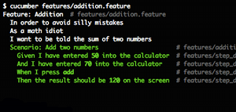

!SLIDE bullets incremental
# Hey, what about those colorful apps like cucumber?
*  
* 

!SLIDE bullets incremental
# The Cucumber Way
* With great power…
* _(to use colors and formatting)_
* …comes great responsibility
* _(to have some taste)_

!SLIDE bullets incremental
# The Cucumber Way
* Don't just “jazz it up”
* Motivate/reinforce behavior
* Or draw attention
* exit codes!
* UNIXy as an option, *always*

!SLIDE bullets incremental
# Which Way??
* Simple => The UNIX Way
* Command Suite => it depends
* Is your app highly complex/sophisitcated?
* Or are you just processing text?
* The UNIX Way is always safe

